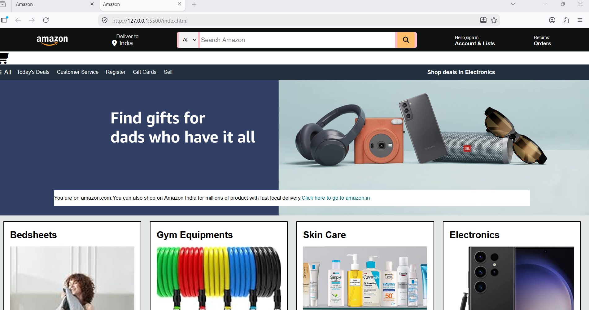

# 🛒 Amazon Clone

A responsive Amazon homepage clone built using **HTML5** and **CSS3**. This project recreates the user interface of Amazon's homepage to strengthen my frontend web development skills.

---

## 📌 Project Overview

The objective of this project was to practice creating a modern e-commerce website layout using only HTML and CSS. It includes a responsive navigation bar, search section, hero banner, product cards, and footer inspired by Amazon's design.

---

## ✨ Features

- Responsive Navigation Bar
- Amazon-style Search Bar
- Delivery Location Section
- Sign In & Orders Menu
- Shopping Cart Icon
- Hero Banner Section
- Product Category Cards
- Hover Effects
- Multi-column Footer
- Clean and Organized UI

---

## 🛠️ Technologies Used

- HTML5
- CSS3
- Font Awesome (Icons)

---

## 📂 Project Structure

```
amazon-clone/
│─> index.html
│─> style.css
│─> amazon_logo.png
│─> hero_image.jpg
│─>box4_image.jpg
│─> box5_image.jpg
│─> box7_image.jpg
│─>box8_image.jpg
│─> main.webp
│─> 81srQx8HNVL_AC_SY200_.jpg
|->71-87y93B+L_AC_SY200_.jpg
|->61VzVSbRTDL_AC_SY170_.jpg
```

---

## 🚀 Getting Started

1. Clone the repository

```bash
git clone https://github.com/kanishkagarg979-stack/amazon-clone.git
```

2. Open the project folder.

3. Open `index.html` in your browser.

No additional installation is required.

---

## 📖 What I Learned

During this project, I gained hands-on experience with:

- HTML page structure
- CSS Flexbox
- CSS Box Model
- Background Images
- Hover Effects
- Positioning and Alignment
- Responsive Layout Basics
- Organizing project files

---

## 🔮 Future Improvements

- Add JavaScript functionality
- Make the search bar interactive
- Add product sliders and carousels
- Improve mobile responsiveness
- Implement a shopping cart
- Connect with a backend database

---

## 📸 Preview




---

## ⚠️ Disclaimer

This project is created **for educational and learning purposes only**. It is not affiliated with or endorsed by Amazon. All trademarks, logos, and brand names belong to their respective owners.

---

## 👩‍💻 Author

**Kanishka**

Computer Science Engineering Student

Learning Web Development • Data Structures & Algorithms • Python • C++ • Open Source

---

⭐ If you like this project, feel free to star the repository!
